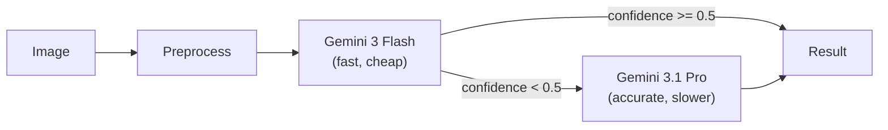

# Next Steps Roadmap

## Current state

- App runs locally, end-to-end working (Gemini 3 Flash → result screen)
- GPT-4o fallback is broken (placeholder key) — currently ignored by the graceful-fallback logic
- Gemini 3.1 Pro confirmed to give better results for tree ring counting

---

## Step 1 — Immediate quality win: swap fallback to Gemini 3.1 Pro

Since you already have a Gemini API key and 3.1 Pro gives better results, the natural move is to replace GPT-4o as the fallback with Gemini 3.1 Pro. Same key, no new account needed, better accuracy when Flash's confidence is low.

**Changes:**

- `[backend/ml/llm_vision.py](backend/ml/llm_vision.py)` — add `analyze_with_gemini_pro()` using model `gemini-3.1-pro-preview`, replace `analyze_with_gpt4o` calls in `count_rings()`
- `[backend/.env.example](backend/.env.example)` — remove `OPENAI_API_KEY` (no longer needed), document the new model strings
- `[app/services/api.ts](app/services/api.ts)` — add `"gemini-3.1-pro"` to the `model_used` union type
- `[app/components/ResultCard.tsx](app/components/ResultCard.tsx)` — add `"Gemini 3.1 Pro"` label

Flow after this change:

---

## Step 2 — Real app icons

The current `assets/images/*.png` files are 1×1 placeholder pixels. Expo Build and the result screen will look broken without proper icons. Need real 1024×1024 `icon.png`, `adaptive-icon.png`, `splash-icon.png`, and 32×32 `favicon.png` — either generated or provided by you.

---

## Step 3 — Deploy

### Backend → Render

- `[backend/render.yaml](backend/render.yaml)` is already written. Steps:
  1. Push repo to GitHub
  2. Connect Render to the repo, set `GEMINI_API_KEY` in Render's env vars
  3. Backend live at `https://tree-rings-counter.onrender.com`

### Web → Vercel

- Run `npx expo export --platform web` → uploads `dist/` to Vercel
- Set `EXPO_PUBLIC_API_URL=https://tree-rings-counter.onrender.com` in Vercel env vars
- App publicly accessible in any browser

---

## Step 4 — Mobile builds (EAS)

- `[app/eas.json](app/eas.json)` is already configured
- Run `eas build --platform ios` / `eas build --platform android`
- Requires real icons (Step 2) and Apple/Google developer accounts

---

## Step 5 — Phase 2: YOLO fine-tuning (longer term)

- Download [Poláček dataset](https://zenodo.org/record/8428752) (~3 GB)
- Run `convert_polacek_to_yolo.py` → `train_yolo26.py`
- Set `USE_YOLO=true` in `.env`
- Benefit: no API cost, works offline, faster inference

---

**Suggested order to tackle:** Step 1 (30 min) → Step 2 (get real icons) → Step 3 (deploy) → Step 4 (mobile). Step 5 is a separate ML project whenever you're ready.